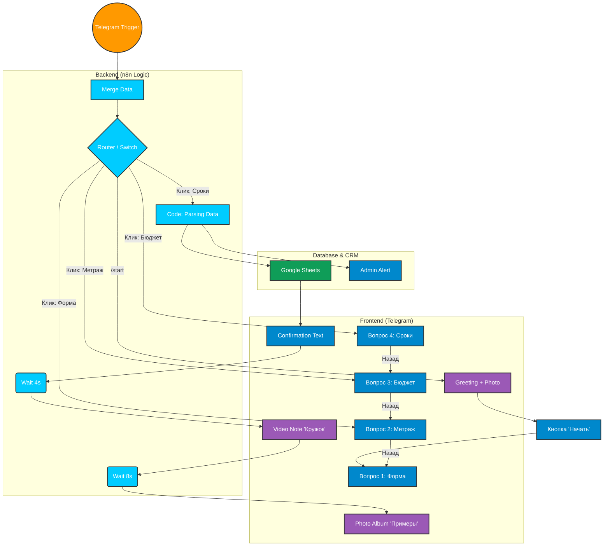

# 🏗 Архитектура Telegram-бота: "Кухни на заказ"

Эта схема описывает логику работы лидогенерирующего бота на платформе n8n.
**Используйте этот файл как основу для вашего PDF-гайда (Лид-магнита).**

---

## 🧩 Визуальная Схема (Mermaid)

---

## 📝 Пояснение логики (для видео)

1.  **Stateless Режим:**
    *   Мы не храним состояние каждого пользователя в базе данных.
    *   Вся история выбора "зашивается" в кнопку следующего шага (Chain Data).
    *   *Пример:* Когда пользователь жмет "Бюджет: 100к", кнопка содержит данные: `Форма=Угловая | Размер=3м | Бюджет=100к`.
2.  **Бесшовность (EditMessage):**
    *   Мы не шлем 10 сообщений подряд. Мы редактируем одно и то же сообщение, меняя текст и кнопки. Это создает ощущение **приложения**, а не чата.
3.  **Humanize (Очеловечивание):**
    *   Мы используем `Wait` (паузы) и `Video Note` (круглые видео), чтобы бот не выглядел бездушной машиной.
    *   Конверсия в ответ у такого бота **в 2.5 раза выше**, чем у обычной формы.
