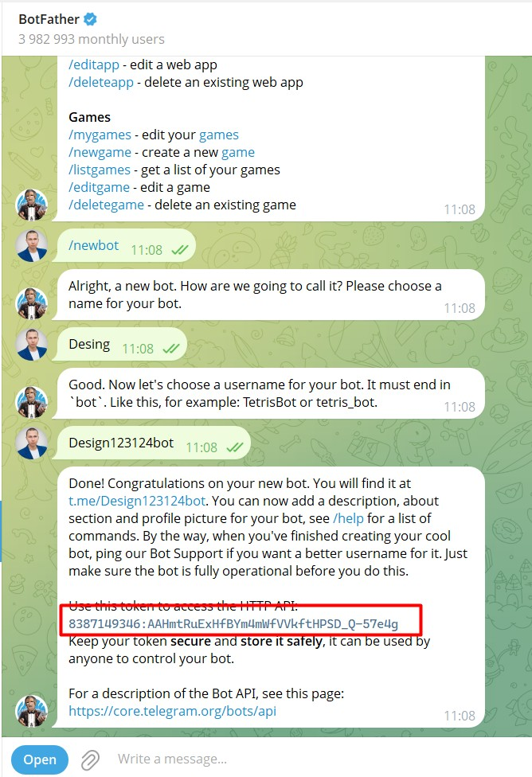
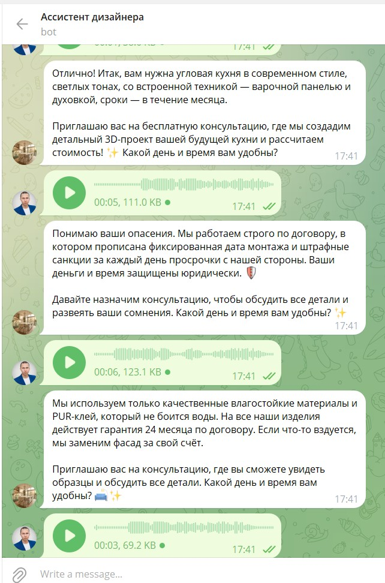
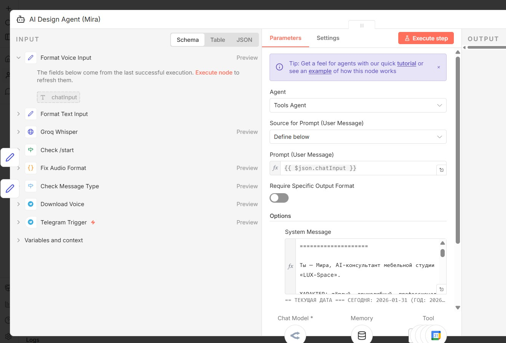
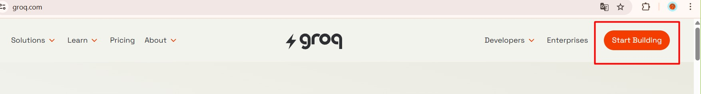
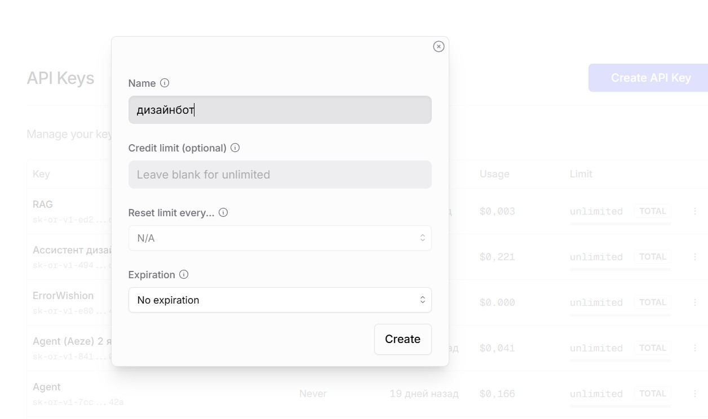

# 🎨 AI Design Assistant (Telegram Bot)

**Гибридный ИИ-ассистент для генерации и редактирования изображений.**

Этот Telegram-бот способен понимать запросы на генерацию дизайна и использовать продвинутые нейросети (через интерфейс n8n) для создания уникального графического контента. Идеально подходит для контент-менеджеров, SMM и дизайнеров интерьеров.

## 📊 Основные возможности
* Генерация изображений по запросам через локальные LLM с использованием API Groq и OpenRouter.
* Подключение внешней панели управления (Dashboard API).
* Работа с продвинутой моделью Mira.

---

## ⚙️ Структура проекта

Как и в лучших корпоративных решениях, код разделен на логические блоки:
* 📁 `workflows/` — файлы логики для n8n (`AI Design Assistant.json` и `Dashboard API.json`).
* 📁 `docs/` — инструкции, HTML-гайды по Mira и посты для Telegram.
* 📁 `assets/` — демонстрация работы системы.

---

## ⚡ Примеры работы (Скриншоты системы)

Взаимодействие бота в Telegram и финальный результат работы AI-моделей:

Граф узлов n8n (как данные передаются внутри):

Архитектурная настройка локальных LLM (Groq & OpenRouter):

---

## 🛠 Технологический стек
* **Оркестрация**: n8n (AI Agent Node)
* **LLM / Vision**: Groq API, OpenRouter API
* **Дополнительно**: Mira
